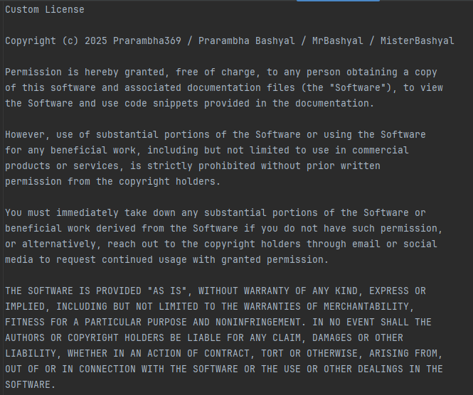

# Pomodoro Timer

A simple Pomodoro Timer application built with HTML, CSS, and JavaScript.

## What's New?

I've just completed an exciting JavaScript project that implements the Pomodoro Technique! The project helps manage time effectively by breaking work into intervals with breaks in between. This simple yet powerful method boosts productivity and prevents burnout.

## Project Details

**Description**: The Pomodoro App is designed to help you focus on one specific task for 25-minute intervals (pomodoros), followed by a short break of 5-10 minutes. After four pomodoros, you take a longer break.

**Code Implementation**: The project is structured with HTML, CSS, and JavaScript files to create a functional and visually appealing Pomodoro timer.

## Features

- Start, pause, resume, and reset the timer
- Task manager to add, mark as done, and remove tasks
- Draggable video section for Lo-Fi music
- Footer that adjusts its position dynamically
- Short breaks of 5 minutes after each pomodoro
- Long breaks of 15 minutes after every four pomodoros

## Getting Started

### Prerequisites

- A web browser

### Usage

1. Open `index.html` in your web browser.
2. Click the `START` button to start the timer.
3. Click the `PAUSE` button to pause the timer.
4. Click the `RESUME` button to resume the timer.
5. Click the `RESET` button to reset the timer to 25:00.
6. Use the task manager to add, mark as done, and remove tasks.
7. Drag the video section to adjust the volume of the Lo-Fi music.

# License
